# Lab 2 Report
## Part 1 Search Engine
>### Code (method called)
>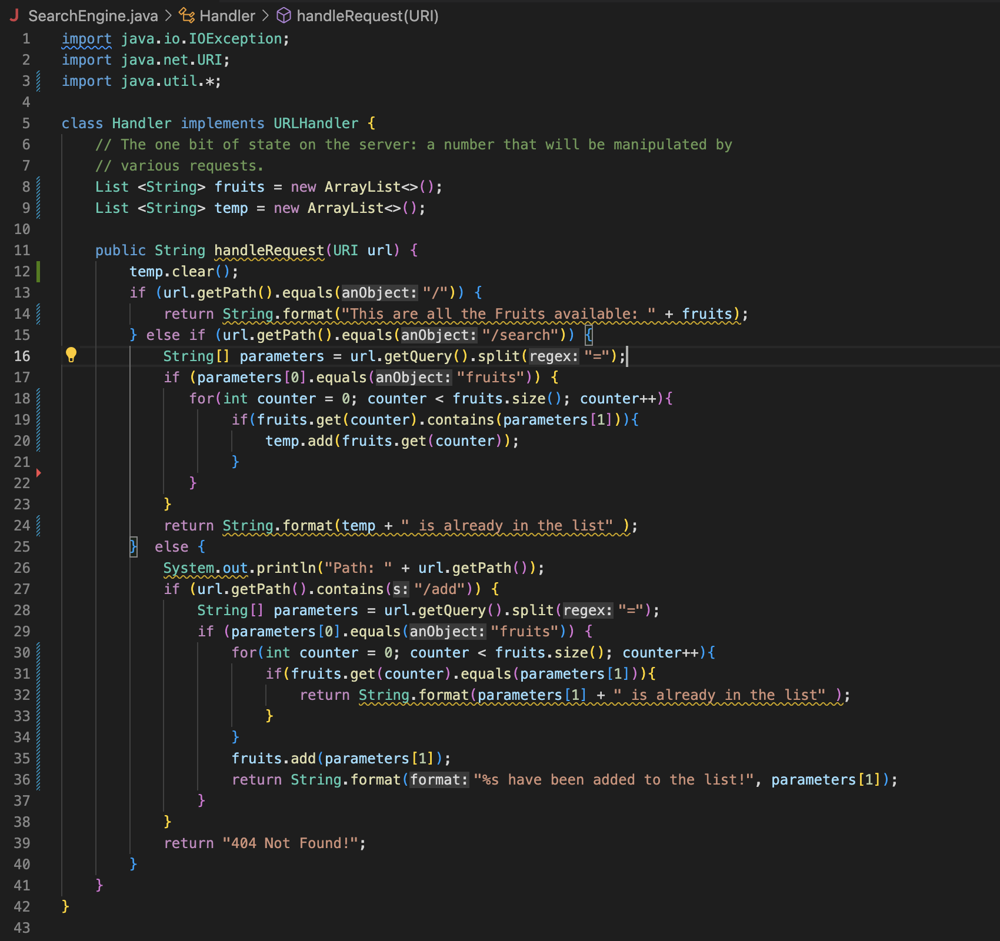
>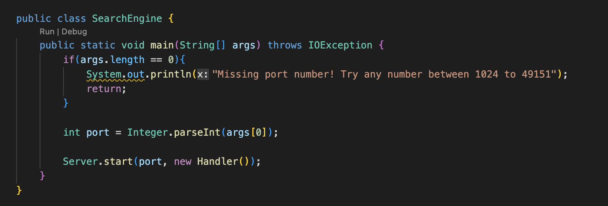
In the code, what i did was by creasing two arrayList one will store all of the list of the fruits and the other one will work as a temporary list, when a search is being held. The method that being called was the handleRequest, where it will get the local address and called out all of the function within it.

>### Default
>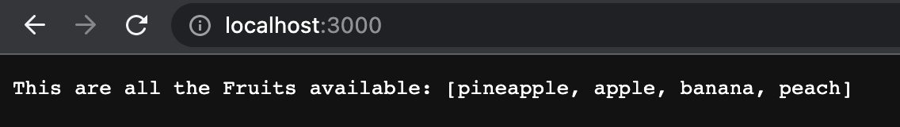
This is the first thing that it will get, i had already place in some default fruits wihtin the list. It is called by giving the '/' symbol at the end of the local address

>### Add
>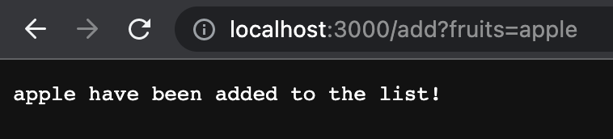
When i called /add?fruits=___ it will check first if the fruit is already within the list or not. If the fruit is a new fruit, the it will ad towards the list as founded in the for- if loop. If it's already in the list than it will stated that the fruit is already in the list

>### Check
>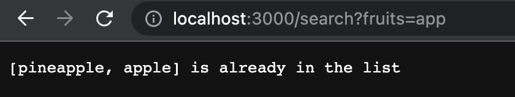
When the /search?fruits=___ is inputed, it will search within the list, by looping the arraylist and check any same character inputed in the parameter. As the method called (url.getQuery().split("=")), where it will get the string after the fruits and discard the '=' symbol. As a result it will look for any character that have the same within the list. As i place an example to search the keyword 'app', it will shows apple and pineapple, as both matches the keywords of app.

>### Error
>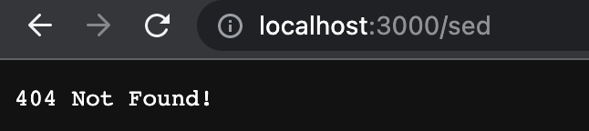
The error works as a default, when non of the methods that i make were called, it will be catch into the default case, which will stated a '404 not found'

---
## Part 2 Debug
### ArrayList
>#### *reversedInPlace*
>
>
reverseInPlace, so when I first run the program, given two additional test of  making the test empty and filled, there were some error in the filled test. I place an input of (1,2,3), where it should be expected an output of (3,2,1). Thus, what happen was that the number 1, that should be place in index 2 was placed in the same index. The bug can be find from the variable that is being change isn’t stored anywhere, where it only stored itself back to its original location. Where i added a temporary variable in the algorithm that is responsible for the reverse.

>#### *reversed*
>
>
reversed, when i run the program at first, it have a similar problem with the reversedInPlace method. In which, when i place in an input of (1,2,3), it should be expected that the value one would be place in the index 2, thus in this case it was place in the same index of 0. Figuring the bug, i found out that the bug was coming from the arr and the newarray was switch within the loop, also, it wasn’t returning the newarray, resulting it to an array of old array with 0 value within all of the index.

>#### *averageWithoutLowest*
>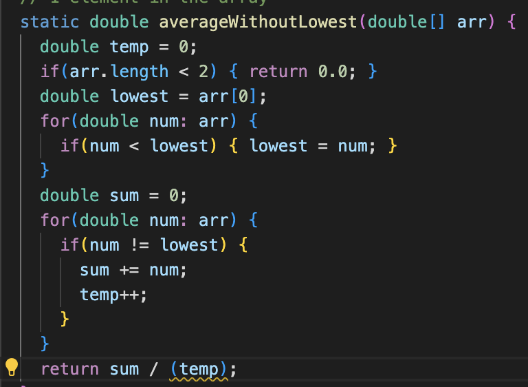
>
averageWithoutLowest, when i run this code for the first time, place in a test value of (6,6,6,7), i would expect the end value would be 7, as all of the lowest value would be remove. Thus, in the first case, it resulted a value of 2.333. In which, the error was found when it returned the value it was divided by the total length of the array, not the total amount of value that was taken (excluding the lowest). It was fixed by adding a counter at everytime it wasn’t the lowest value (the temp variable) and at the end the total sum was divided by the counter (temp), not by the length of the array - the counter. 

### LinkedList
> #### filter
>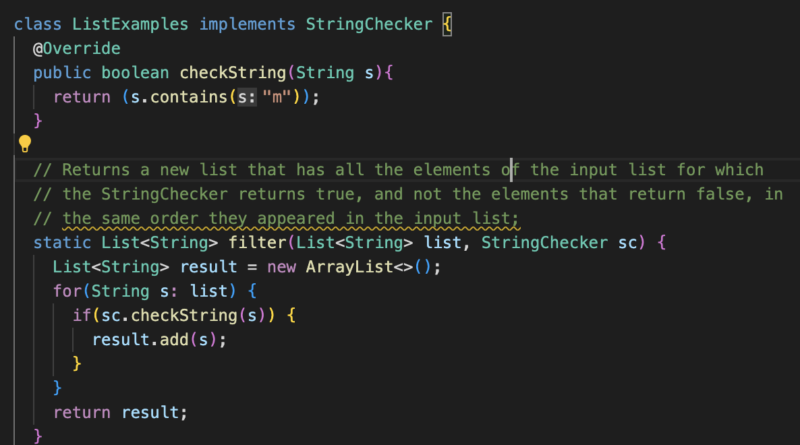
>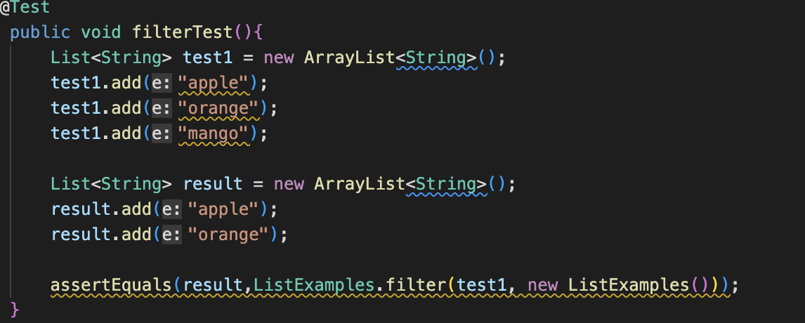
In the filterTest, i place the my first list with apple, orange and mango. then i place the result list with apple and orange where since i place the string checker to check if the list contain any letter of "m". Where at the first run it failed the test as it returned my list such as my reversed order method, which is filter but reversing the order. As everytime it loops it always added to the very frist of the index. What i did was change the result.add(index, string) into jadu result.add(string), because the index would not matter in this case

> #### merge
>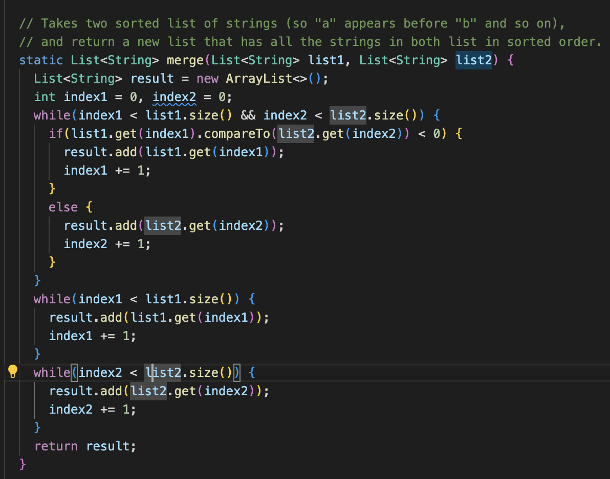
>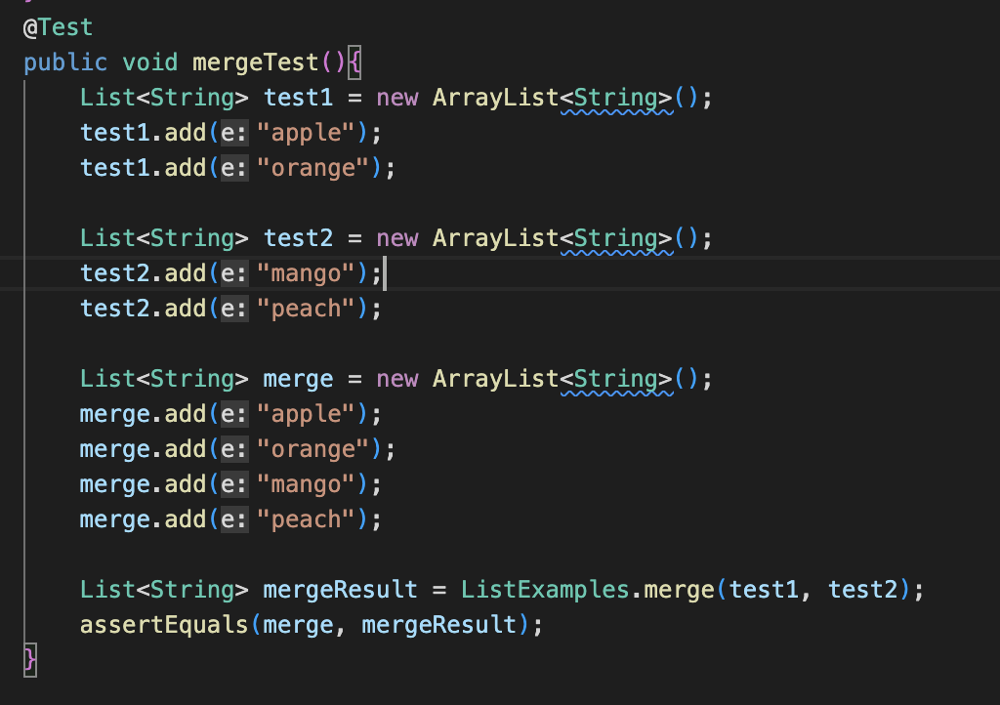
In the mergeTest i inputed apple and orang in my first list and mango and peach in my second  list. Where when i first run the program there were an error stating that i had a heap space error, stating that i had run down my memory. I figure out the bug was founded because the index2 wasn't getting incremendted as in the initial program it was the index1 getting increment resulting into an infinite loop.
