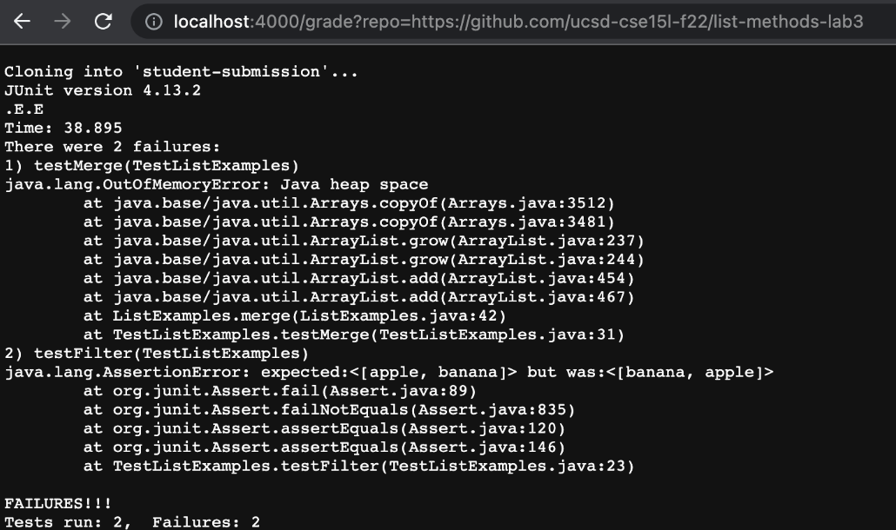

# Lab Report 5
## grade.sh code
```
# Create your grading script here

#clear the folder and start the bash file
rm -rf student-submission
#clone the the file
git clone $1 student-submission
echo 'Finished cloning'

cp -r TestListExamples.java student-submission/
cp -r lib student-submission/

cd student-submission

#check wether ListExamples.java exists
if [[ -f ListExamples.java ]]

then #if file is found than go next
    echo "file found"

else #file not found, grade = 0 and return fail
    echo "file not found"
    echo "failed"
    exit 1
fi

#compile the java files and report the output to the compile-output.txt
javac -cp .:lib/hamcrest-core-1.3.jar:lib/junit-4.13.2.jar *.java 2> compile-output.txt
#if successful
if [[ $? -eq 0 ]]
then
    echo "compiled success"
    java -cp .:lib/hamcrest-core-1.3.jar:lib/junit-4.13.2.jar TestListExamples.java > passed.txt 2> failed.txt
    if [[ $? -eq 0 ]]
    then
        echo grep -i "Compilation Successful" passed.txt
        echo "passed"
        exit
    else  
        echo "Error Test:"
        cat failed.txt
    fi
else
    cat compile-output.txt
    echo "FAILURES!!!"
    exit 1
fi
```
  
## screenshot of the the test
> result  
Base on the the screen shot it shows a "FAILURES!!!". It first  start by clear the folder and start the bash file then cloning the student-submission. Then it check if List examples is success, but since it failed it returens "FAILURES!!!" and exit the program.
